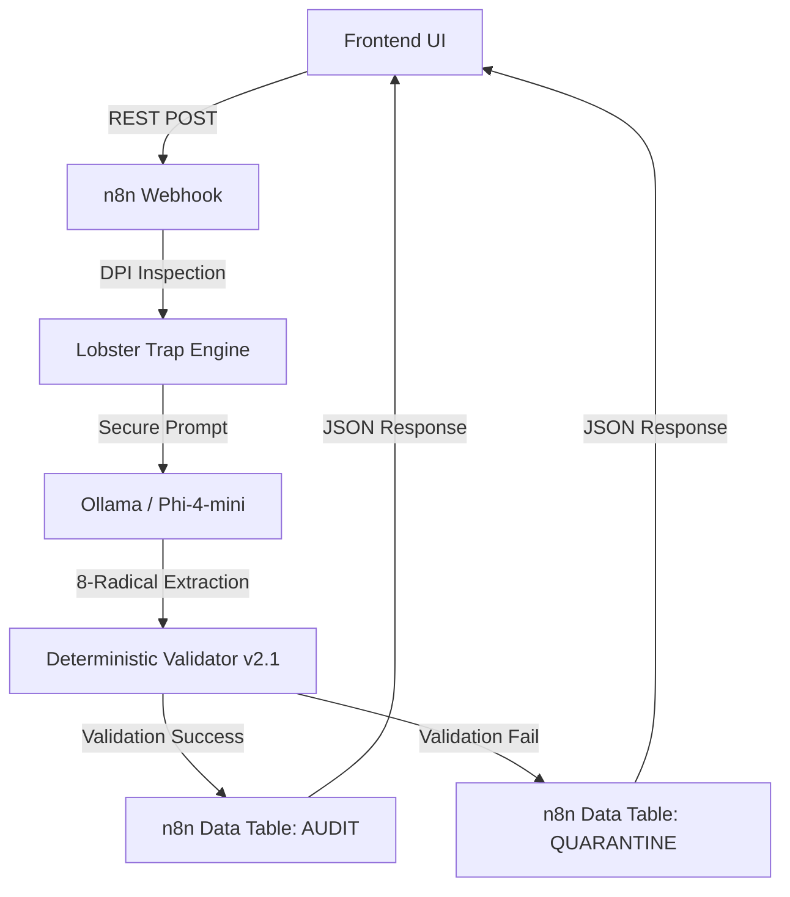
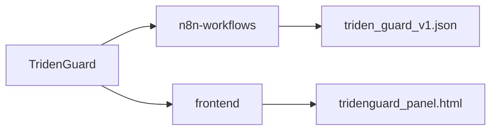

# 🛡️ TridenGuard

**Deterministic firewall for LLM hallucinations in legal and financial documents.**

## Problem

In 2025-2026, courts sanctioned lawyers for filing AI-hallucinated citations:
- *Lacey v. State Farm*: $31,100 sanctions
- *Russell v. Mells*: Referral to Florida Bar
- *Flycatcher v. Affable*: Default judgment

LLMs cannot distinguish contract text from malicious instructions (LegalPwn) and often "invent" clauses or metrics that don't exist.

## Real Court Cases (2025-2026)

| Case | Sanction | Key Finding |
|------|----------|-------------|
| **Lacey v. State Farm** | $31,100 | Lawyer filed 9 incorrect citations, 2 hallucinated |
| **Lexos Media v. Overstock** | Show cause order | Lawyer admitted no verification of AI output |
| **Russell v. Mells** | Florida Bar referral | Completely invented case citation |

## Solution: The 8-Radical Ontology

TridenGuard enforces a strict, neuro-symbolic schema using 8 orthogonal atomic radicals:
- **Actor** | **Deontic** | **Action** | **Object** | **Temporal** | **Spatial** | **Metric** | **Condition**

If the LLM fails semantic completeness (e.g., extracting an Action without an Actor) or fails schema validation, the entry is automatically **QUARANTINED** for human review.

## Architecture

## Tech Stack

- **n8n**: Orchestration, state management, and native **Data Tables**.
- **Lobster Trap (Go)**: Deep Prompt Inspection (DPI) and PII filtering.
- **Ollama (Phi-4-mini)**: Local inference for zero-latency data residency.
- **Deterministic Validator**: Custom JS engine enforcing semantic completeness rules (Guardian Logic).

## 🗺️ Roadmap: From Local Validation to Sovereign Fine-Tuning

### ✅ V1 (Current MVP) — Structural Firewall
**Goal:** A verifiable, zero-trust legal firewall running 100% locally.

- **Finished:** REST API (n8n), Lobster Trap DPI, Ontology (8 Radicals), Semantic Rules (A/B), Data Tables Audit/Quarantine.
- **Next (before final submission):** 
    - ✅ Dynamic `rejection_reason` tagging for every blocked entry.
    - ✅ Simple frontend panel to review and resolve quarantine cases (Approve/Discard buttons).
    - End-to-end testing with 8 orthogonal test vectors covering factual, reputational, privacy, and security dimensions across common law, civil law, and Chinese legal systems.

### 🧠 V2 — Grounding & Hybrid Observability
**Goal:** Eliminate hallucinated content and build the first version of the audit flywheel.

- **Topological Grounding:** Mandatory `source_span` (verbatim quote) for each radical to prove factual existence in the source document.
- **Rejection Analytics:** Structured logging (JSONL) with `pipeline_stage`, `rule_id`, and `reason_code` fields for direct analysis.
- **Local UI:** Panel with approve/discard actions connected to n8n webhooks for real-time quarantine resolution.

### 🔁 V3 — The Local Fine-Tuning Flywheel (Moat)
**Goal:** Use real human feedback (Approve/Discard) from the quarantine log to fine-tune a local, specialized model.

- **Dataset Curation:** Convert quarantine logs (Rejected vs. Chosen) into a preference dataset.
- **Fine-Tuning (Gemma 4 / Phi-4):** Train a lightweight, on-premise adapter using PEFT (LoRA) on Apple Silicon (MPS) or CPU.

Each client defines their validation schema using Pydantic (custom radicals, business rules, compliance checks). The schema is compiled to GBNF to force the model to output only valid structures at the token level. LoRA fine-tuning adapts Gemma 4 E2B to the client's specific terminology and document patterns. Everything runs on local hardware. No data leaves the premises.

- **Edge Deployment:** Replace the base LLM with `TridenGemma` — a model with near-zero hallucination rates for your specific contract taxonomy, retrained locally without ever sending a single clause to the cloud.

> **The Moat:** Every human decision (Approve/Discard) makes the local model smarter. Pydantic defines the contract. GBNF enforces it. LoRA personalizes it. No cloud. No data leakage. Just a continuously improving, sovereign AI.

## 📊 Project Status (Sprint: May 11-15)

**Current Phase: Construction Kickoff**

- **✅ Done**: Webhook REST, Lobster Trap DPI, 8-Radical Validation.
- **🏗️ Next (Mon 11)**: Core Engine Hardening (UUIDs + Rejection Logic).
- **🚀 Goal (Fri 15)**: Full MVP with human-in-the-loop resolution panel.
- **🔗 Roadmap**: See the full [Construction Sprint Plan](docs/weekly_roadmap.md).

## 🚀 Quick Start

1. `docker-compose up -d`
2. Import `n8n-workflows/triden_guard_v1.json` into your n8n instance.
3. Ensure Ollama is running with `phi4-mini:3.8b`.
4. Send a test POST to `http://localhost:5678/webhook/tridenguard`.

## Repository Structure

## License

MIT License - Copyright (c) 2026 AlexusPacicus
