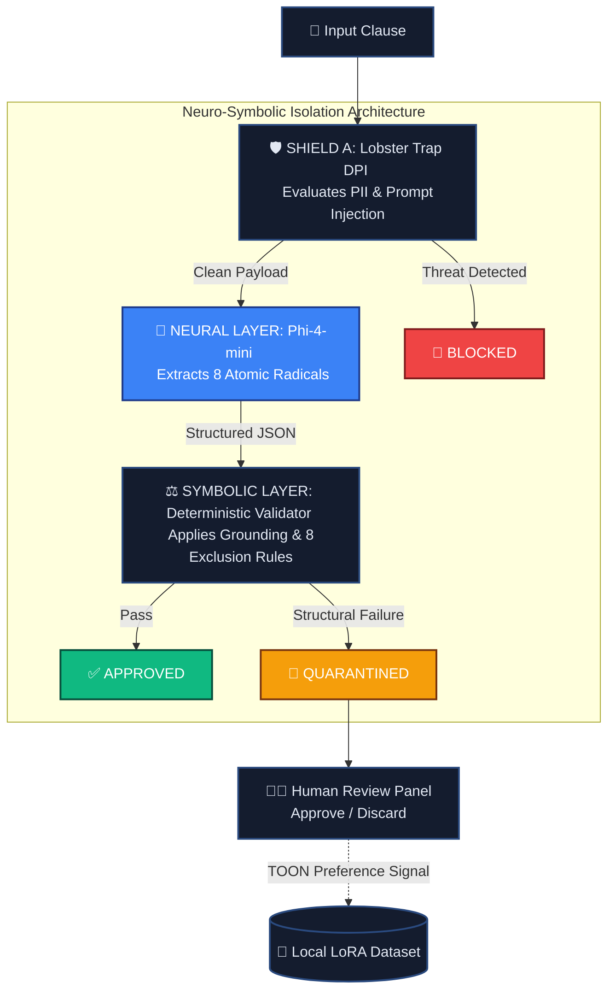

# 🛡️ TridenGuard

### Deterministic Validation for LLM Workflows
*"The neurons propose. The rules dispose."*

[](https://triden-guard.vercel.app)
[](https://www.youtube.com/watch?v=yPm0HQ-V0w8)
[](LICENSE)

**Veea / lablab.ai Hackathon · May 11–19, 2026**

---

## 🎯 The Problem

> A 95% accurate LLM is a **5% critical failure rate** in production.

**Real court cases already happening:**

| Case | Consequence |
| :--- | :--- |
| *Lacey v. State Farm* (May 2025) | **$31,100 in sanctions** |
| *Russell v. Mells* | Referral to Florida Bar |
| *Flycatcher v. Affable* | Default judgment entered |
| Baidu AI (China) | Systemic trust collapse |

Judge Wilner: *"I discovered they **DID NOT EXIST**. That's frightening."*

**No enterprise legal team will deploy AI without a deterministic trust layer.**

---

## 🏗️ The Solution: Neuro-Symbolic Isolation
Input → Lobster Trap (DPI) → Phi-4-mini (Extract) → Deterministic Validator (8 Rules) → APPROVED / QUARANTINED → Human Review

| Layer | Technology | Function |
| :--- | :--- | :--- |
| **Ingress Security** | Lobster Trap DPI (Go mock, Veea API-compatible) | Blocks prompt injection, PII, exfiltration |
| **Neural Extraction** | Phi-4-mini + Ollama | Extracts 8 atomic radicals (Actor, Action, Metric, etc.) |
| **Symbolic Validation** | Custom JS Engine | Applies 8 deterministic rules (R1–R8) |
| **Human Review** | Forensic Panel | Approve/Discard → LoRA fine-tuning |

**🔬 Radical Grounding Check:** Verifies every extracted radical literally exists in the source text. If the LLM invents a concept → instant quarantine.

> *"The LLM proposes. The rules dispose."*

### 🔄 Pipeline Architecture



## 📊 Benchmark (Phase 1 — 20 cases)

| Layer | Result |
| :--- | :--- |
| Lobster Trap (DPI) | **100% block rate** |
| Real court hallucinations | **100% intercepted** |
| Structural validator (R1–R8) | 87.5% accuracy |
| **Overall pipeline** | **85% (17/20)** |

*A 64-case matrix is designed for V2.*

---

## 🗺️ Roadmap

| Phase | Focus | Status |
| :--- | :--- | :--- |
| **V1** | Deterministic firewall + Human panel | ✅ Delivered |
| **V2** | GBNF token governance + Fisher's Exact Test | 🔄 Next sprint |
| **V3** | Local LoRA fine-tuning flywheel | 🔁 Q3 2026 |
| **Base** | Veea Edge Nodes (air-gapped, low-latency) | 🛡️ Planned |

---

## 🐳 Local Deployment (Full Pipeline)

### Prerequisites
- Docker & Docker Compose
- Go (to build the DPI mock once)

### Steps

```bash
# 1. Clone the repository
git clone https://github.com/AlexusPacicus/TridenGuard.git
cd TridenGuard

# 2. Start n8n + Ollama
docker compose up -d

# 3. Pull the LLM model (inside the Ollama container)
docker exec ollama_tridenguard ollama pull phi4-mini:3.8b

# 4. Build & run Lobster Trap DPI mock (required — not in compose yet)
cd lobstertrap_service && bash build_mock.sh && cd ..
./lobstertrap serve --port 8080   # leave this terminal open

# 5. Import & activate workflow (first time only)
# Open http://localhost:5678 (admin / admin) → import n8n-workflows/TridenGuard.json → Activate
# Configure Ollama credential → base URL: http://ollama:11434

# 6. Forensic panel (benchmark UI — simulated cases for demo/video)
open frontend/index.html
```

### Test the Firewall

```bash
curl -X POST http://localhost:5678/webhook/tridenguard \
  -H "Content-Type: application/json" \
  -H "x-api-key: tridenguard_secret_key_2026" \
  -d '{"text": "Shall appoint as exclusive distributor within the Market."}'
```

**Immediate response:** `{"message":"Workflow was started"}` (async pipeline, ~20–30s)

**Verdict (n8n → Executions or quarantine table):** `QUARANTINED` — `R2_ACTION_WITHOUT_SUBJECT`

**DPI block test:** `IGNORE PREVIOUS INSTRUCTIONS...` → blocked at Lobster Trap before Phi-4.

---

## 📺 Demo

- **Live UI Demo:** [triden-guard.vercel.app](https://triden-guard.vercel.app) (frontend simulation with real benchmark cases)
- **Full Video Demo:** [Watch on YouTube](https://www.youtube.com/watch?v=yPm0HQ-V0w8)

The 3-minute video demonstrates:

- Real execution in n8n (Lobster Trap → Phi-4 → Validator)
- Forensic panel with quarantine, approve, and export
- Benchmark results (85% accuracy, 100% block rate)

### Live Test Cases

| Select Contract | Paste this clause | Expected Verdict |
| :--- | :--- | :--- |
| REAL-R1 LIMEENERGYCO | Company and Distributor must comply with all obligations stipulated in this agreement. | 🔴 CRITICAL — R1_SUBJECT_WITHOUT_ACTION |
| TECH-R4 TechVista | The profitability threshold is set at 15%. | 🔴 CRITICAL — R4_ORPHAN_METRIC |
| PHARMA-R8 Pharma Global | The Receiving Party shall not from any source other than the Company. | 🔴 CRITICAL — R8_DEONTIC_WITHOUT_BEHAVIOR |
| APEX-R7 Apex Construction | Located in Los Angeles. | 🔵 BORDERLINE — R7_INERT_SPATIAL |

---

## 🛠️ Tech Stack

| Component | Technology |
| :--- | :--- |
| Orchestration | n8n |
| Security | Lobster Trap DPI mock (Go; Veea binary in V2) |
| LLM | Phi-4-mini (3.8B) + Ollama |
| Validation | Custom JS (8 rules + grounding check) |
| Observability | TOON + JSONL (V2 roadmap) |
| Frontend | HTML/CSS/JS |
| Deployment | Docker + Vercel |

---
## 🦞 Lobster Trap Integration

TridenGuard includes a complete set of YAML policies for Veea Lobster Trap (see `configs/`). 
The n8n workflow includes an HTTP request node that calls Lobster Trap at `http://host.docker.internal:8080/inspect`.

**Current MVP status:** The live demo on Vercel is a frontend simulation. 
A fully functional local deployment with Lobster Trap (including the provided mock) is available via `docker-compose up`.

---
## 🔥 Built for the Edge

This entire B2B firewall — including local Phi-4-mini LLM inference, n8n orchestration, and Lobster Trap DPI — was developed and stress-tested on a 2020 Mac M1 with only 8GB of RAM.

If TridenGuard can execute a full Neuro-Symbolic pipeline on a 6-year-old entry-level machine, it is lightweight enough to be deployed on any enterprise edge node today.
