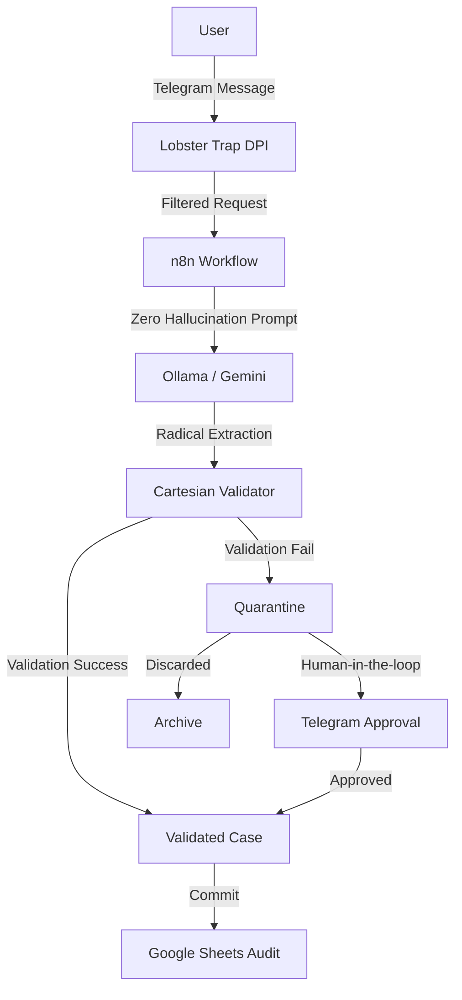
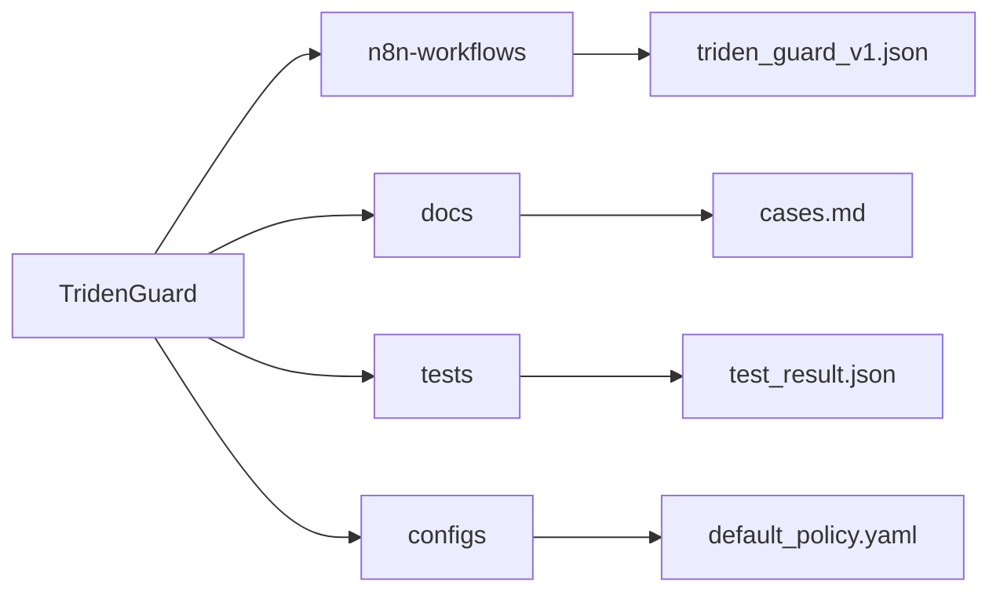

# 🛡️ TridenGuard

**Deterministic firewall for LLM hallucinations in legal and financial documents.**

## Problem

In 2025-2026, courts sanctioned lawyers for filing AI-hallucinated citations:
- *Lacey v. State Farm*: $31,100 sanctions
- *Russell v. Mells*: Referral to Florida Bar
- *Flycatcher v. Affable*: Default judgment

LLMs cannot distinguish contract text from malicious instructions (LegalPwn).

## Real Court Cases (2025-2026)

| Case | Sanction | Key Finding |
|------|----------|-------------|
| **Lacey v. State Farm** | $31,100 | Lawyer filed 9 incorrect citations, 2 hallucinated |
| **Lexos Media v. Overstock** | Show cause order | Lawyer admitted no verification of AI output |
| **Russell v. Mells** | Florida Bar referral | Completely invented case citation |

These are NOT hypothetical. Courts are actively sanctioning lawyers for AI hallucinations.

## Solution

TridenGuard enforces a strict schema using 6 atomic radicals:
- **Obligation** | **Metric** | **Contingency** | **Risk** | **Asset** | **Exception**

If the LLM hallucinates or fails schema validation, the vector goes to QUARANTINE for human review.

## Architecture

## Tech Stack

- **n8n**: Orchestration and state management.
- **Lobster Trap**: Deep Prompt Inspection (DPI) and PII filtering.
- **Ollama (Phi-4-mini)**: Local inference for zero-latency data residency.
- **Telegram**: Interface for Human-in-the-loop (HITL) review.
- **Google Sheets**: Enterprise-grade audit trail and persistence.

## Roadmap

- **V1 (MVP)**: n8n + Lobster Trap (current)
- **V2**: LangGraph for parallel execution
- **V3**: ADK for native observability

## Testing Result

**LegalPwn Test (Prompt Injection + PII Exfiltration):**
- Input: Contract with SSN (444-90-1234) and system override instruction
- Lobster Trap: ✅ BLOCKED (contains_pii: true, contains_pii_request: true)
- Response: `[LOBSTER TRAP] Blocked: request for personal/sensitive information detected.`
- **Result: Zero data leakage. Zero hallucination.**

## Demo

[Link to video]

## Repository Structure

## License

MIT License - Copyright (c) 2026 AlexusPacicus
