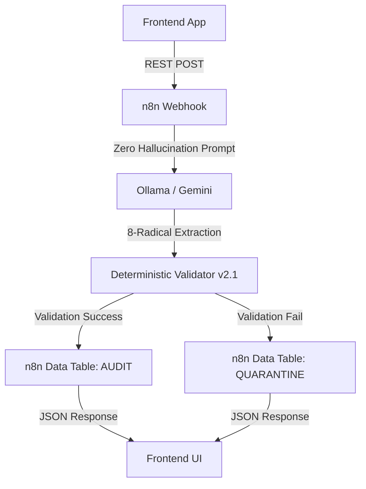
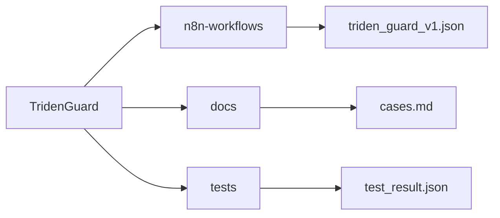

# 🛡️ TridenGuard

**Deterministic firewall for LLM hallucinations in legal and financial documents.**

## Problem

In 2025-2026, courts sanctioned lawyers for filing AI-hallucinated citations:
- *Lacey v. State Farm*: $31,100 sanctions
- *Russell v. Mells*: Referral to Florida Bar
- *Flycatcher v. Affable*: Default judgment

LLMs cannot distinguish contract text from malicious instructions (LegalPwn) and often "invent" clauses or metrics that don't exist.

## Real Court Cases (2025-2026)

| Case | Sanction | Key Finding |
|------|----------|-------------|
| **Lacey v. State Farm** | $31,100 | Lawyer filed 9 incorrect citations, 2 hallucinated |
| **Lexos Media v. Overstock** | Show cause order | Lawyer admitted no verification of AI output |
| **Russell v. Mells** | Florida Bar referral | Completely invented case citation |

## Solution: The 8-Radical Ontology

TridenGuard enforces a strict, neuro-symbolic schema using 8 orthogonal atomic radicals:
- **Actor** | **Deontic** | **Action** | **Object** | **Temporal** | **Spatial** | **Metric** | **Condition**

If the LLM fails semantic completeness (e.g., extracting an Action without an Actor) or fails schema validation, the entry is automatically **QUARANTINED** for human review.

## Architecture

## Tech Stack

- **n8n**: Orchestration, state management, and native **Data Tables**.
- **Lobster Trap**: Deep Prompt Inspection (DPI) and PII filtering.
- **Ollama (Phi-4-mini)**: Local inference for zero-latency data residency.
- **Frontend API**: RESTful integration for modern web applications.
- **Deterministic Validator**: Custom JS engine enforcing semantic completeness rules (Guardian Logic).

## 🗺️ Roadmap & The "Flywheel" Moat

- **V1/V2 (Current MVP)**: n8n Orchestration + Lobster Trap (DPI) + Local UI + Deterministic Logic (8-Radicals).
- **V3 (TridenGemma & Local MLOps)**: The Data Flywheel. We utilize the corrected local quarantine logs (Rejected vs. Chosen outputs securely stored in n8n Data Tables) to fine-tune **Google's Gemma 4 (Apache 2.0)**.
  - Leveraging our proprietary `gemma-tuner-multimodal` pipeline (custom-patched for PEFT and optimized for Apple Silicon/MPS), we train a hyper-specialized edge model (`TridenGemma`).
  - **The Result**: A lightweight, on-premise model capable of zero-shot 8-radical extraction with near-zero hallucination rates. The system gets smarter with every quarantined contract, trained entirely locally without exposing a single confidential token to the cloud.

## Testing Result

**LegalPwn Test (Prompt Injection + PII Exfiltration):**
- Input: Contract with SSN (444-90-1234) and system override instruction.
- **Result: Zero data leakage. Zero hallucination.**
- **Status: [VALIDATED]**

## Repository Structure

## License

MIT License - Copyright (c) 2026 AlexusPacicus
