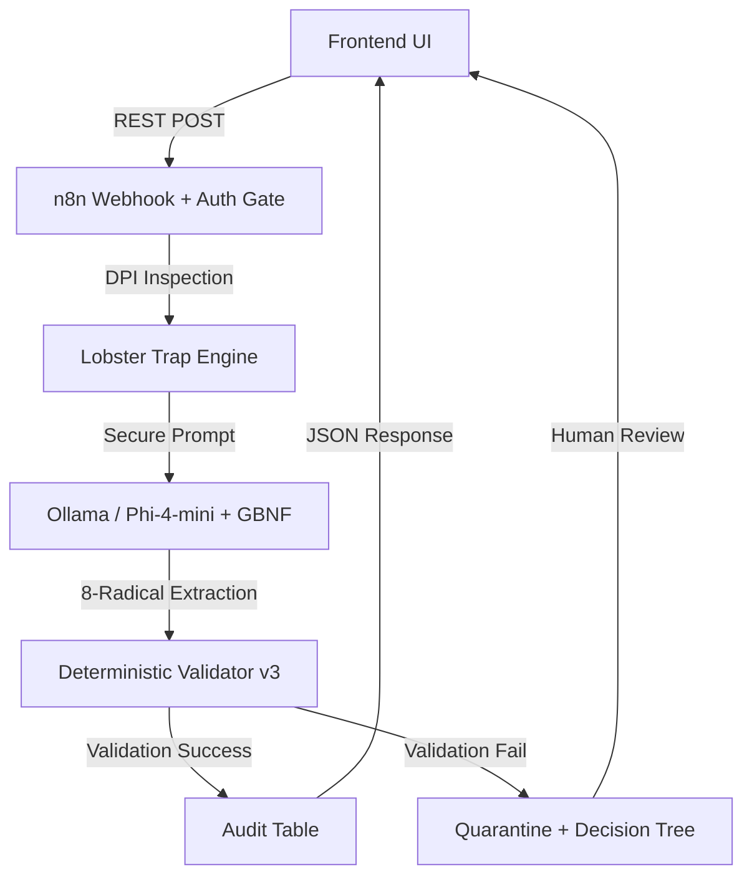

# 🛡️ TridenGuard

**Deterministic firewall for LLM hallucinations in legal and financial documents.**

## Problem

In 2025-2026, courts sanctioned lawyers for filing AI-hallucinated citations:
- *Lacey v. State Farm*: $31,100 sanctions
- *Russell v. Mells*: Referral to Florida Bar
- *Flycatcher v. Affable*: Default judgment

LLMs cannot distinguish contract text from malicious instructions (LegalPwn) and often "invent" clauses or metrics that don't exist.

## Solution: The 8-Radical Ontology

TridenGuard enforces a strict, neuro-symbolic schema using 8 orthogonal atomic radicals:
- **Actor** | **Deontic** | **Action** | **Object** | **Temporal** | **Spatial** | **Metric** | **Condition**

If the LLM fails semantic completeness (e.g., extracting an Action without an Actor) or fails schema validation, the entry is automatically **QUARANTINED** for human review.

## 🏗️ Pre-Hackathon Status

**This repository contains the project blueprint, documentation, infrastructure configuration, and test data designed before the hackathon start (May 11, 2026).**

All application code —including n8n workflows, the deterministic validator, the quarantine panel, and Lobster Trap integration— will be developed, committed, and iterated upon **during the hackathon week (May 11-19, 2026).**

## 🏆 Hackathon Goal — Veea Award (Track 1)

Building a **Unified Security Layer for AI Agents** using Lobster Trap as the single source of truth for Ingress, Egress, and Quarantine policy enforcement.

**Targeting:**
- Measurable risk reduction (64-case benchmark)
- Audit trails a regulator could read (JSONL + TOON)
- Human-in-the-loop governance dashboard
- First-match-wins policy enforcement across the entire pipeline

## Architecture

## Tech Stack

- **n8n**: Orchestration, state management, and native **Data Tables**.
- **Lobster Trap (Go)**: Unified Security Layer handling Ingress (DPI/PII), Egress (GBNF Schema Integrity), and Quarantine routing via Decision Tree.
- **Ollama (Phi-4-mini)**: Local inference for zero-latency data residency.
- **Deterministic Validator**: Custom JS engine enforcing semantic completeness rules (8 Atomic Rules).

## 🗺️ Roadmap: From Local Validation to Sovereign Fine-Tuning

### ✅ V1 (Hackathon MVP) — Structural Firewall
**Goal:** A verifiable, zero-trust legal firewall running 100% locally.

**To build this week:**
- REST API (n8n) with Auth Gate
- Lobster Trap DPI integration (Ingress + Egress)
- Information Extractor with 8-Radical Ontology
- Deterministic Validator (R1-R8 rules)
- Data Tables (Audit + Quarantine)
- Human-in-the-loop review panel
- 64-case benchmark execution

### 🧠 V2 — Grounding & Hybrid Observability
**Goal:** Eliminate hallucinated content and build the audit flywheel.
- **Topological Grounding**: Mandatory `source_span` for each radical
- **Rejection Analytics**: Structured logging (JSONL) with `pipeline_stage`, `rule_id`, `reason_code`
- **Quarantine Decision Tree**: CRITICAL, WARNING, PII_LATE, UNKNOWN routing

### 🔁 V3 — The Local Fine-Tuning Flywheel (Moat)
**Goal:** Use real human feedback from the quarantine log to fine-tune a local, specialized model.
- **Logographic Quarantine (TOON)**: Convert quarantine logs into a semantic preference dataset using TOON. Reduces token size by 40-60% vs JSON.
- **Fine-Tuning (Gemma 4 E2B)**: Train a lightweight, on-premise adapter using PEFT (LoRA) on Apple Silicon.
- **Pydantic + GBNF**: Each client defines their validation schema. Schema is compiled to GBNF to force valid token-level output.

> **The Moat:** Every human decision (Approve/Discard) makes the local model smarter. Pydantic defines the contract. GBNF enforces it. TOON compresses the training data. LoRA personalizes the model. No cloud. No data leakage.

## 📊 Project Status (Sprint: May 11-19)

**Current Phase: Hackathon Construction**

- **✅ Pre-Hackathon**: Architecture design, 8-rule ontology, 64-case benchmark design, infrastructure setup (Docker, Ollama, n8n), documentation.
- **🏗️ Hackathon (May 11-19)**: Workflow assembly, validator implementation, panel development, Lobster Trap integration, stress testing, demo recording, submission.

## 🚀 Quick Start (Post-Hackathon)

1. `docker-compose up -d`
2. Import the workflow into your n8n instance.
3. Ensure Ollama is running with `phi4-mini:3.8b`.
4. Send a test POST to `http://localhost:5678/webhook/tridenguard`.

## License

MIT License - Copyright (c) 2026 AlexusPacicus
